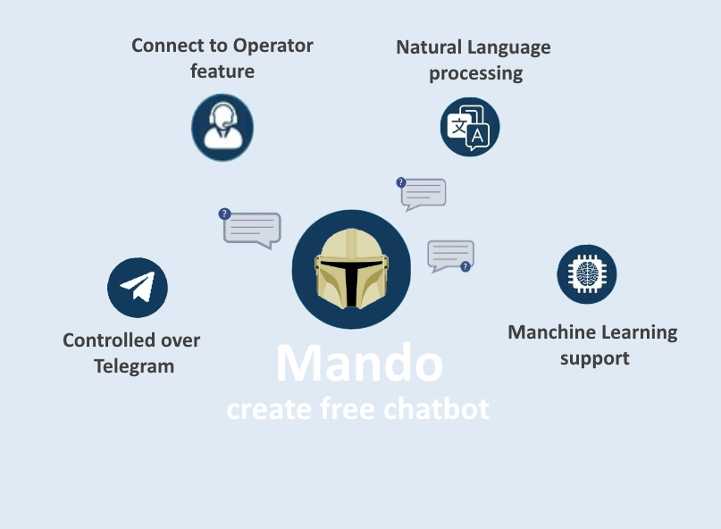

# Mando - create free chatbot

[](https://travis-ci.com/mykovolod/mando-chatbot) 

This is free chatbot builder platform powered by SpringBoot and ApacheOpenNLP libs



Use Mando chatbot to create and menage your own chatbot using Telegram

Just try yourself here -> <a href="https://t.me/create_free_chatbot">Open Telegram Bot Mando</a>

## Quick Start

**Prerequisites**

Please be sure that the following components are installed on your computer before running locally:

- JDK 11
- Gradlew
- MongoDb

**Custom properties**

You also you need to set the following properties 

~~~~
# telegram
TELEGRAM_BOT_NAME=yourBotName
TELEGRAM_BOT_KEY=yourBotApiKey
TELEGRAM_BOT_OWNER_USERID=yourTelegramChatId
# db
MONGO_URL=mongodb://localhost:27017/yourDataBaseName
~~~~

## Current issues

- no unit test coverage
- overcomplicated Telegram workflow

## Deploy with dokku in DigitalOcean

### Setup new sever
1. Create [new server and access it via SSH](https://www.banjocode.com/post/hosting/setup-server-hetzner/)
1. Install [dokku](https://dokku.com/docs/getting-started/installation/#1-install-dokku) on you newly created server
1. Run following command to setup new application on dokku
```
dokku git:allow-host github.com
dokku mongo:create bot-db
dokku apps:create bot
dokku resource:limit --memory 500 bot
dokku config:set bot TELEGRAM_BOT_NAME=???
   TELEGRAM_BOT_KEY=???
   TELEGRAM_BOT_OWNER_USERID=??? JAVA_OPTS='-Xmx200m'
dokku mongo:link bot-db bot
```
4. `dokku docker-options:add chargebro build,deploy "--cpus='0.7' -m='300m'"` - to not use all resources during deploy
4. Create personal [access token](https://docs.github.com/en/authentication/keeping-your-account-and-data-secure/creating-a-personal-access-token#creating-a-token) in GitHub account
4. Add that toke to dokku  
   `dokku git:auth github.com ?username? ?personal-access-token?`
   
###Deploy steps
1. Push the latest changes to GitHub
1. Login with SSH to your server and run
```
dokku git:sync --build bot https://github.com/mykovolod/mando-chatbot.git
```
3. Check logs
   `dokku logs bot -t`
